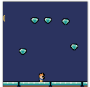
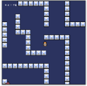

# [LIFSP_2026_24](https://jdolivet.github.io/NSI-Projets/Divers/NdC/2026/Python-Première/LIFSP_2026_24/index.html)

Ce jeux est de minimalisme extreme.  
Prenez les diamants, bouger avec les arrow keys, faites en moins de 15 secondes et voila.

Lien vers le jeu en ligne : 
[https://jdolivet.github.io/NSI-Projets/Divers/NdC/2026/Python-Première/LIFSP_2026_24/index.html](https://jdolivet.github.io/NSI-Projets/Divers/NdC/2026/Python-Première/LIFSP_2026_24/index.html)

# [LIFSP_2026_25](https://jdolivet.github.io/NSI-Projets/Divers/NdC/2026/Python-Première/LIFSP_2026_25/index.html)

Bienvenue dans Surnaturêve, dans ce jeu, vous êtes prisonnié de vos propres rêves et vous devez vous en échappé en passant par le labyrinthe de votre esprit. Malheureusement pour vous les objets qui dans la vie réel ne bougeaient pas cherchent ici à vous tuer.  
Pour vous déplacer, vous devez appuyer sur les touches multidirectionnelles, étant donnée que vous êtes dans votre rêve, vous pouvez traverser les murs bien que cela vous perturbe mentalement et vous fait perdre des points de précieux point de vie.  
Vous gagnez le jeu une fois que vous arrivez au drapeau bien que vos rêves continuent.  
Si vous aimez de la bonne musique, écoutez celle de ce jeu !!!!!!

Lien vers le jeu en ligne : 
[https://jdolivet.github.io/NSI-Projets/Divers/NdC/2026/Python-Première/LIFSP_2026_25/index.html](https://jdolivet.github.io/NSI-Projets/Divers/NdC/2026/Python-Première/LIFSP_2026_25/index.html)
