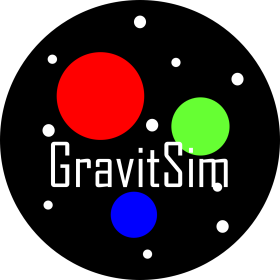
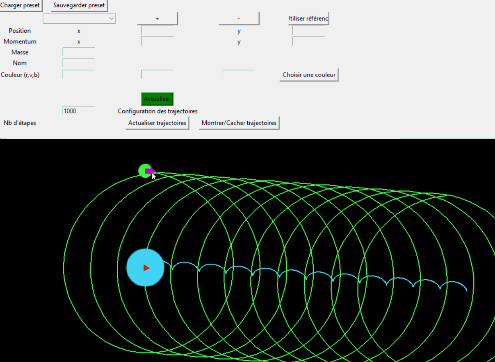

# GravitSim

## Sur GravitSim
GravitSim est une application qui simule des intéractions gravitationelles dans un espace 2D, tout en permettant l'utilisateur d'éditer l'environnement et les grandeurs physiques. L'application permet aussi de visualiser les trajectoires et les futures collisions des corps.

## Installation
Pour executer GravitSim, python3 doit être installé. 

L'installation des modules se fait par `>> pip3 install -r requirements.txt` 

L'execution du projet se fait par `>> python3 main.py`

## Fonctionnalités
### Interface d'édition
L'interface d'édition a été faite avec le module Tkinter.

Quand ouverte, l'interface d'édition nous permet de créer des corps et de configurer leurs grandeurs physiques.

Pour créer un corps, suffit appuyer `Ajouter corps`, pour l'enlever appuyer `Enlever corps`

Quand un corps est selectonné dans la boîte combo, ses paramètres comme leur position, vitesse (momentum sous forme vectorielle), masse, nom, couleur sont configurables.

Quand le corps est configuré, appuyer le boutton vert actualiser qui sauvegarde les paramètres du corps. 

L'interface edition permet de sauvegarder dans `Sauvegarder preset` la configuration planétaire actuelle dans un preset ou d'ouvrir dans `Charger preset` des presets déjá préparées précédemment qui incluent des situations simples comme des situations très spécifiques.

Les trajectoires des corps peuvent être afichées avec `Montrer/Cacher trajectoires` et manuellement actualisées avec (`Actualiser trajectoires`). Le nombre d'étapes calculées sont configurées dans `Nb. d'étapes`, et le corps selectionné peut être pris comme référence planétaire par le bouton `Utiliser réf`. ATTENTION! Le calcul et affichache des trajectoires peut être très computationellement couteux, attention lors de montrer les trajectoires dans quelques presets comme `DebutSystemeSolaire`

### Simulation
En haut à droite est la languette simulation où la vitesse des pas peut être configurée (Il faut appuyer `Actualiser simulation` pour actualiser la vitesse des pas) et la simulation peut être arrêtée ou reprise.

### Interface graphique
L'interface graphique a été faite avec le module Pygame.

Quand ouverte elle nous permet de visualiser les corps présents dans l'espace crée et de visualiser leurs vecteurs vitesse, trajectoires et collisions (quand la languette édition est selectionnée).

On peut glisser la camera avec les flèches du clavier ou WASD, on peut zoomer avec la roue de la souris.

L'édition de quelques attributs comme la position et la vitesse d'un corps peut être altérée dans la fenêtre de l'interface graphique avec la souris: On peut bouger le corps en le clicant et bougeant la souris, ou modifier sa vitesse en clicant la flèche du corps et la changeant.

